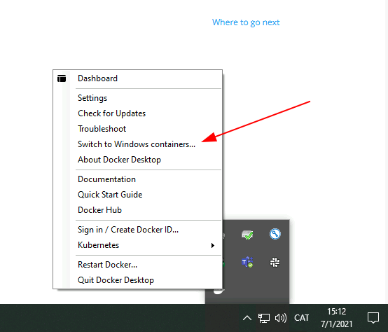

# 1. Instal·lació de Docker

Docker està basat en Linux però hi ha versións per els grans sistemes operatius Windows, MacOs. Es pot descarregar d'[Aquí](https://docs.docker.com/get-docker/)

La instal·lació bàsica de Linux només conté el motor de Docker mentre les versions de Windows i MacOs són un paquet d'aplicacions (Docker Desktop)

> En Windows hi ha característiques diferents en funció de la versió:
>
> | Versió                          |                                                                                   |
> | ------------------------------- | --------------------------------------------------------------------------------- |
> | Windows 10 Home                 | Necessita WSL 2. Només executa contenidors Linux                                  |
> | Windows 10 professional, Server | Necessita HyperV, Windows containers, Permet executar contenidors Windows i Linux |
>
> En general els contenidors Linux són més ràpids en WSL2

Docker en Windows es pot administrar des de la barra de tasques

